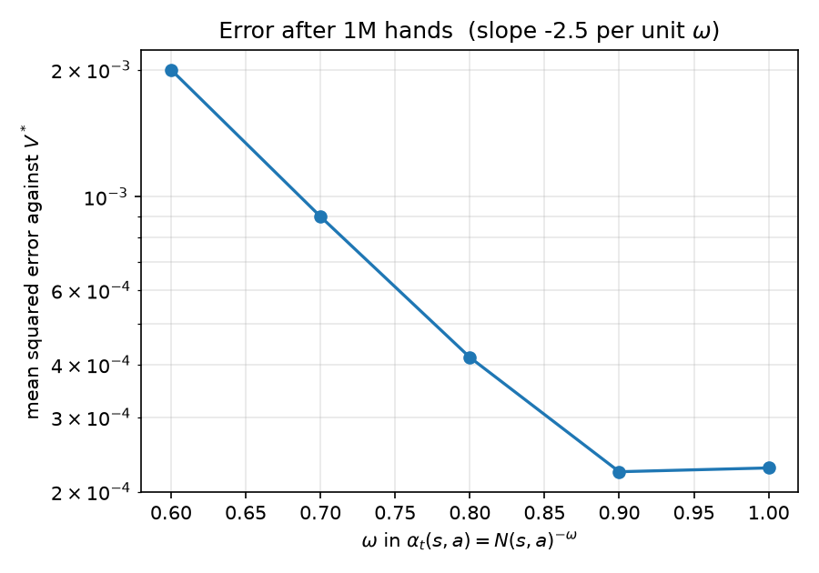

# Blackjack: RL against an exact answer

Most reinforcement learning projects can't tell you how wrong they are. The
agent produces a policy, the policy looks reasonable, and there's nothing to
compare it against.

Blackjack with replacement is small enough to solve exactly. It's a finite MDP
with 200 decision states, and the transition probabilities come from the card
distribution rather than from simulation. So I can compute the optimal policy
by dynamic programming, then train a Q-learning agent that knows none of the
rules and measure exactly how far off it ends up.

Then I made the problem harder in two steps: a real six-deck shoe where the
edge moves, and Kelly sizing on that edge. The RL part stopped working in the
second step, which is the more interesting half of the project.

```
159 tests    ~660 lines of logic    1,840 lines of tests
```

## Contents

- [Quick start](#quick-start)
- [Part 1: the exact solution](#part-1-the-exact-solution)
- [Part 2: does Q-learning find it?](#part-2-does-q-learning-find-it)
- [Part 3: a finite shoe and card counting](#part-3-a-finite-shoe-and-card-counting)
- [Part 3b: index plays, where it stopped working](#part-3b-index-plays-where-it-stopped-working)
- [Part 4: how much to bet](#part-4-how-much-to-bet)
- [Can you actually win?](#can-you-actually-win)
- [Bugs I found later](#bugs-i-found-later)
- [Design notes](#design-notes)
- [Layout](#layout)
- [Limitations](#limitations)

---

## Quick start

Needs Python 3.10 or later (the code uses `X | None` type hints).

```bash
pip install -r requirements.txt

pytest -m "not slow"     # 158 tests, ~8 seconds
pytest                   # 159, adds a 1M-hand convergence check
```

Every number below comes from one of these commands:

```bash
python main.py dp --chart --double     # exact solution + strategy chart
python main.py ql --episodes 5000000   # Q-learning vs that solution
python main.py omega                   # step-size sweep
python main.py count --hands 3000000   # edge by true count
python main.py risk --paths 400        # Kelly sizing and risk metrics
python main.py figures                 # regenerate the five figures
```

---

## Part 1: the exact solution

Value iteration on the infinite-deck MDP. No discounting, 200 decision states,
converges in 13 sweeps to a sup-norm change below 1e-9.

| | computed | published |
|---|---|---|
| expected return, hit/stand only | −2.421% | −2.421% |
| expected return, doubling allowed | −1.087% | −1.087% |
| value of the double | +1.334% | |

One thing worth explaining: γ = 1 means the Bellman operator isn't a
contraction, so convergence doesn't follow from the usual fixed-point argument.
It works here because every hand ends. Each hit strictly increases the player's
total and the total is capped at 21, so no policy can play forever. That makes
this a stochastic shortest path problem where every policy is proper, and the
fixed point is still unique.

I check the answer three ways, because it's the kind of number that can be
wrong while still looking sensible:

1. Against published figures for these rules, to five significant figures.
2. Against simulation. The solver computes probabilities by hand and never
   simulates; the environment simulates and never uses those probabilities.
   Playing the optimal policy for 300k hands lands within three standard errors
   of the exact value.
3. Against Q-learning, which starts from nothing but sampled rewards.

A fourth check shows up in Part 3.

### The bug I got wrong first

When the dealer shows an ace or a ten they check for blackjack before I act, so
every decision happens conditional on the dealer not having one. The hole-card
distribution has to be renormalised by that. My first version didn't do it,
which moved the EV by 0.16 percentage points (−1.087% became −1.249%) while
still producing a strategy chart that looked exactly like the published one.

---

## Part 2: does Q-learning find it?

Five million hands of tabular Q-learning, off-policy TD control, starting from
a table of zeros:

| | |
|---|---|
| mean squared error vs V* | 6.5 × 10⁻⁵ |
| decisions matching π* | 98.5% (197 of 200) |
| cost of the mismatches | **2.47 bps** |

The last row is the one I care about. Three cells still disagree, but instead
of reporting "98.5% accurate" I evaluate the learned policy exactly (same
Bellman backup, no max) and take the difference in expected value. It costs
2.47 basis points against a house edge of 242. The agent recovers about 99% of
the available value.

Why bps rather than cell count: across three seeds the number of wrong cells
barely moves (2 or 3) but the cost ranges from 0.44 to 2.47 bps, a factor of
5.6. Seed 7 happens to miss two of the cheapest cells on the chart, so being
wrong there is nearly free. "Three cells wrong" doesn't answer the question
anyone has.

### The step size mattered more than I expected

With the usual α = n^−0.6 the error plateaued and only 96% of decisions
matched. What made it diagnosable was that every mismatch went the same way:
the agent hit where the optimum stands. A one-sided error is bias, not
variance, so training longer wouldn't have helped.

α = n^−ω averages over a window of roughly n^ω samples, so the MSE should scale
like n^−ω. Sweeping ω at one million hands:

| ω | 0.6 | 0.7 | 0.8 | 0.9 | 1.0 |
|---|---|---|---|---|---|
| MSE | 2.0e−3 | 9.0e−4 | 4.2e−4 | 2.2e−4 | 2.3e−4 |

ω = 1 gives α = 1/n, the exact running sample mean, and still satisfies
Robbins-Monro. About nine times better than ω = 0.6.

The curve flattens and slightly reverses at the top, which the theory doesn't
predict. At ω = 1 the earliest updates keep full weight forever, and their
targets were bootstrapped from a table that was still empty. Slightly ω < 1
decays that contamination away. Monte Carlo averaging wouldn't show this, so
it's specific to TD.

I also tested that scaling law wrong at first. Comparing across ω at a fixed
budget suggests raising ω from 0.6 to 1.0 should divide the error by about 400.
It divides it by 9. The law describes decay in n at a *fixed* ω and says
nothing about the prefactor, which also depends on ω. Done properly (following
the error in n at ω = 1) the fitted slope is −1.09 against −1.00 predicted.



---

## Part 3: a finite shoe and card counting

With replacement the edge is identical every hand, so there's nothing to bet
on. A six-deck shoe dealt without replacement changes that. A Hi-Lo running
count divided by decks remaining ("true count") compresses the shoe state into
one number.

Playing the fixed Part 1 strategy for 3 million hands, recording each outcome
under the count that preceded the deal:

| true count | hands | edge | 95% interval |
|---|---|---|---|
| < −3 | 262,112 | −3.429% | [−3.861, −2.998] |
| −3..−2 | 202,822 | −2.211% | [−2.698, −1.724] |
| −2..−1 | 373,115 | −1.890% | [−2.248, −1.533] |
| −1..0 | 567,873 | −0.973% | [−1.262, −0.684] |
| 0..1 | 796,606 | −0.942% | [−1.186, −0.699] |
| 1..2 | 352,521 | −0.404% | [−0.769, −0.039] |
| 2..3 | 193,357 | +0.267% | [−0.222, +0.757] |
| ≥ 3 | 251,594 | +0.890% | [+0.463, +1.317] |

Monotone across all eight bins, crossing zero near true count +2. Aggregated it
comes to −1.074%, against −1.087% computed exactly in Part 1. That's 1.3 bps
apart from two calculations that share no code, which is the fourth check.


### Look-ahead bias

A bet is placed before any card of the hand is visible, so the only count I can
use for sizing is the one from before the deal. Reading the count after the
cards are out and attributing the outcome to it uses information that didn't
exist at decision time. Same error as a backtest reading tomorrow's prices.

It raises no exception and produces a smooth, convincing, fictitious edge
curve. The environment snapshots the count as the first statement of `reset()`,
so a caller can't get the wrong one even by accident.

---

## Part 3b: index plays, where it stopped working

Adding the count bin to the state grows it from 200 to 1600 decision states.
Training 8 million hands, the agent departs from the infinite-deck policy in 46
cells.

The first version of this section reported that the agent had recovered a
well-known index play (stand on hard 16 vs a ten once the true count reaches 0)
at exactly the published threshold, with 68,681 hands behind it. That was
wrong. The dealer's face-down card was being counted before the agent decided,
which changed the bin it observed on 19.9% of hands. The agent wasn't learning
to count, it was partly reading the hole card.

After fixing that and rerunning, deviations drop from 58 to 46, and the cell
that the claim rested on goes back to hitting. Here's `hard 16 vs 10` across
all bins:

| true count | learned | hands |
|---|---|---|
| < −3 | hit | 27,425 |
| −3..−2 | hit | 20,627 |
| −2..−1 | **stand** | 36,825 |
| −1..0 | hit | 58,729 |
| 0..1 | hit | 67,777 |
| 1..2 | **stand** | 32,045 |
| 2..3 | **stand** | 17,616 |
| ≥ 3 | **stand** | 22,460 |

The threshold moved up a bin, and a deviation appeared at −2..−1, which is
backwards. That cell has 36,825 hands, so it isn't a thin-tail artefact.

Checking all 46 deviations against the direction theory predicts (toward
standing as the count rises, toward hitting as it falls):

| | count |
|---|---|
| predicted direction | 33 |
| wrong direction | 13 (28%) |
| among the 20 best-supported cells | 18 of 20 correct |

So the direction reproduces where there's enough data and stops where there
isn't. I'm not quoting thresholds. The gaps being estimated are 0.0006 to 0.02
and the agent's noise floor from Part 2 is about 0.007, which is a
two-order-of-magnitude mismatch that more hands won't fix.

An earlier draft of this paragraph said the direction was "intact across every
well-sampled hand" and listed four hands that agreed. I picked those four after
seeing the results, which isn't evidence. The table above is what checking all
46 actually shows.

---

## Part 4: how much to bet

Kelly maximises expected log wealth. For a payoff X per unit staked the
growth-optimal fraction is f* = μ / E[X²]. Not (bp−q)/b, which is the
two-outcome special case and silently drops the +1.5 and ±2 payoffs blackjack
has.

That formula is second order in f, not exact. On the ≥3 bin (μ = 0.00890,
E[X²] = 1.19474) it gives 0.00745 against a numerical optimum of 0.00746, so it
under-bets by 0.1%. The direction depends on the third moment: E[X³] = +0.213
here because of the +1.5 natural and the +2 double, so the next Taylor term
raises the optimum. A negatively skewed payoff would reverse it.

**The significance gate refuses 7 of 8 bins.** Only ≥3 has a lower confidence
bound above zero. The 2..3 bin has a positive point estimate (+0.267%) but an
interval straddling zero, so it doesn't get bet. An edge estimated from a
finite sample is partly noise, and Kelly applied to a noisy estimate doesn't
just add variance, it systematically overbets.

Where the loss comes from turns out to matter more than where the edge is. The
two positive bins contribute +0.09% between them; the six negative bins take
−1.17%. So the question isn't how hard to bet the good counts, it's whether you
have to play the bad ones:

| | median final | mean drawdown |
|---|---|---|
| flat 1 unit, must bet every hand | 959.0 | 11.5% |
| half Kelly, must bet every hand | 962.4 | 14.4% |
| half Kelly, allowed to sit out | 1017.3 | 9.0% |
| full Kelly, allowed to sit out | 1027.8 | 17.3% |

Full Kelly grows faster than half Kelly with nearly double the drawdown, which
is the expected ordering.


### Final bankroll is the wrong metric

A strategy that sits out 92% of hands wagers a third as much money. In a game
that's negative-EV most of the time, wagering less loses less, so a higher
final bankroll doesn't prove anything on its own. The question is whether the
money actually at risk earned a return.

Over 250 paths, return on capital wagered:

| | mean P&L | mean wagered | return on capital | t |
|---|---|---|---|---|
| flat, must bet | −42.87 | 5,000 | −0.857% | −8.32 |
| half Kelly, sit out | +20.36 | 1,581 | **+1.165%** | +3.51 |
| full Kelly, sit out | +40.42 | 3,182 | +0.948% | +2.85 |

That settles it. The capital deployed earns a positive return, and +1.165% is
consistent with the +0.890% edge measured for the one bin it bets.

At 60 paths the same measurement gave −0.076%, opposite sign, inside the noise
of the 250-path figure. Nothing read off a few dozen paths here is a result.

### Separating betting from playing

Changing the sizing rule and the playing strategy at the same time tells you
nothing about which one caused the improvement. Running all four combinations
on identical seeds lets me pair the paths, which removes most of the
path-to-path variance:

| effect | paired difference | standard error | t |
|---|---|---|---|
| bet sizing | +61.45 | 4.80 | +12.80 |
| count-dependent play | +4.41 | 2.53 | +1.74 |

Bet sizing is unambiguous. Count-dependent play is a small positive effect that
this sample size can't resolve.

Two things I got wrong here. First, comparing medians of the four distributions
independently gave the playing effect as −2.0, the wrong sign; the median is a
poor estimator of a difference between two distributions. Second, an earlier
version reported "97% from betting, 3% from playing" to match the roughly 90/10
in Griffin and Wong. You can't take a percentage of a quantity whose sign is
uncertain, so I dropped the split and kept the direction.

### Where the theory doesn't apply

The closed-form risk of ruin under fractional Kelly, P(touch x) = x^((2−λ)/λ),
predicts 12.5% for half Kelly and 50% for full. Measured ruin is 0% in every
configuration.

That's not a bug. The formula assumes continuous time, infinitely divisible
bets, a known edge, and an infinite horizon. Here the horizon is 5,000 hands,
only about 8% are bet above the minimum, and Kelly asks for well under 1% of
bankroll even then. Reaching half the starting bankroll would be roughly a
three-sigma event.

CVaR is quoted with a bootstrap interval (VaR 144, CVaR 173, 95% interval
[143, 188]) because a 99% tail statistic from 400 paths rests on about four
observations.

---

## Can you actually win?

Yes, but not by much, and not by playing well.

The winning configuration is "half Kelly, allowed to sit out", and it only bets
421 of 5,000 hands. It's a strategy for declining to play, not for playing
better.

| | flat betting | sit out |
|---|---|---|
| mean profit per 5,000-hand session | −42.87 | +20.36 |
| sessions that end in profit | 31.2% | 57.2% |
| hands actually bet | 5,000 | 421 |
| standard deviation per session | 81.52 | 81.20 |

At 10 dollars a unit and 100 hands an hour, one session is 50 hours and about
200 dollars, so roughly **4 dollars an hour**, with a standard deviation four
times the mean.

How long before the edge shows up:

| sessions | hours | chance you're still down |
|---|---|---|
| 1 | 50 | 40.1% |
| 10 | 500 | 21.4% |
| 50 | 2,500 | 3.8% |
| 100 | 5,000 | 0.6% |

Three reasons this doesn't transfer to a real casino. Sitting out isn't free:
the model stakes zero while the hand is still dealt, but many casinos block
mid-shoe entry and back-counting gets you asked to leave. The edge table came
from 3 million simulated hands, which you'd have to get from published tables
in practice, and those are rule-specific. And the worst session in 250
simulations lost 150 units, so you need a bankroll several times that.

Card counting works mathematically and barely works as a job. The hard part
isn't the maths.

---

## Bugs I found later

Six defects turned up after the test suite was green, and none of them crashed
anything. The full list with measurements is in the commit history; the short
version:

- **The dealer's hole card was counted before I decided.** Changed the observed
  count bin on 19.9% of hands and invalidated Part 3b until it was rerun. Found
  by someone reading the code, not by any test.
- **The step size wasn't the sample mean it claimed to be.** α = (1+N)^−ω left
  the estimate shrunk toward zero by n/(n+1). A unit test asserted the buggy
  value, so the suite was protecting the bug.
- **CVaR was understated when probability mass sat exactly at VaR.** With 99
  break-even paths and one wipeout, the naive average gives 1.0 where the
  correct answer is 10.0.
- **A read-only query mutated the agent.** `greedy_policy()` drew its tie-break
  from the agent's generator, so inspecting the agent at checkpoints changed
  the training. Introduced by fixing a cosmetic bias measured at 0.000000 bps.
- **Doubling was allowed without the funds to cover it**, with the shortfall
  clamped away at zero.
- **Four docstring figures didn't match measurement**, including one that made
  a test bound 16% looser than intended.

The pattern is that dangerous errors in this kind of code produce plausible
numbers rather than exceptions. Everything above is now pinned by regression
tests, and I checked those tests have teeth by reintroducing each bug and
confirming they go red.

---

## Design notes

**The step size decays per state-action pair, not on a global clock.** Visit
frequencies differ by a factor of 135 between the most and least visited cell
of the decision region. On a global clock the step size would collapse at rare
states that have barely been updated.

**Exploration decays to a floor, not to zero.** This keeps every pair
reachable. It's safe only because Q-learning is off-policy: the max in the
target means it learns the greedy policy's value whatever the behaviour policy
does. SARSA under the same schedule would converge to the ε-greedy policy's
value instead.

**The shoe is an explicit 312-card array, not a count vector.** Dealing a card
that was never in the shoe becomes impossible rather than just detectable.

**Every random source is created from a seed and passed explicitly.** Nothing
touches the global numpy state. I ran every command on Windows (3.12.8) and
Linux (3.12.3) and compared digit by digit, including the 5-million-hand
training run.


---

## Layout

```
blackjack/
  rules.py            card distribution, hand arithmetic, seeded generators
  hand.py             rules shared by both environments
  env.py              infinite-deck simulator
  dp.py               dealer distribution, value iteration, policy evaluation
  qlearning.py        tabular agent, training loop, comparison against V*
  shoe.py             six-deck shoe, dealt without replacement
  counting.py         Hi-Lo, true count, payoff tracker
  finite_env.py       finite-shoe simulator
  qlearning_count.py  agent over the count-augmented state
  simulate.py         playing hands, measuring edge, bankroll paths
  sizing.py           Kelly fraction, fractional Kelly, significance gate
  risk.py             VaR, CVaR, drawdown, risk of ruin, bootstrap
  plots.py            the five figures

tests/    159 tests across 8 files
main.py   command-line entry point
```

---

## Limitations

Splitting isn't implemented. It's worth roughly +0.6% of expected value, so
−1.087% isn't the full house edge for these rules.

`main.py` has no tests. It's the only layer without coverage and it's exactly
where one defect slipped through: a stale function signature that made
`main.py risk` crash while every test stayed green.

Index-play thresholds don't resolve at 8 million hands, so I only report the
direction.

The risk-of-ruin comparison against the closed form isn't a meaningful test at
this horizon.

Wonging is modelled as staking zero while the hand is still dealt. A real
player also has to avoid being noticed, which isn't measurable here.