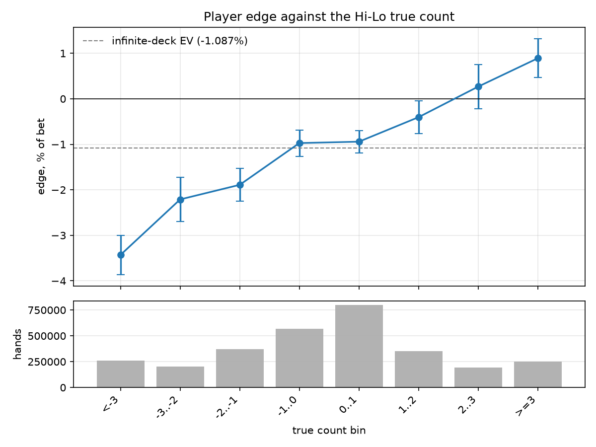
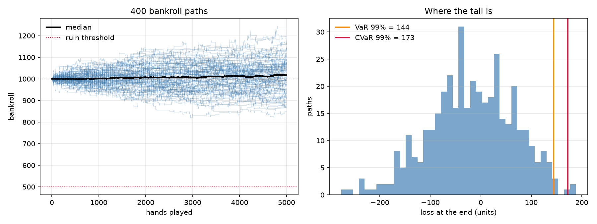
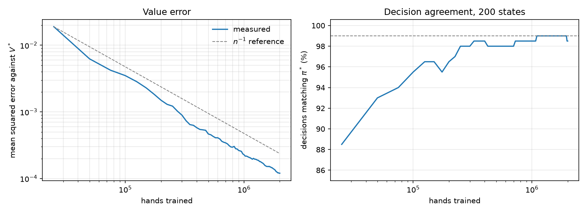
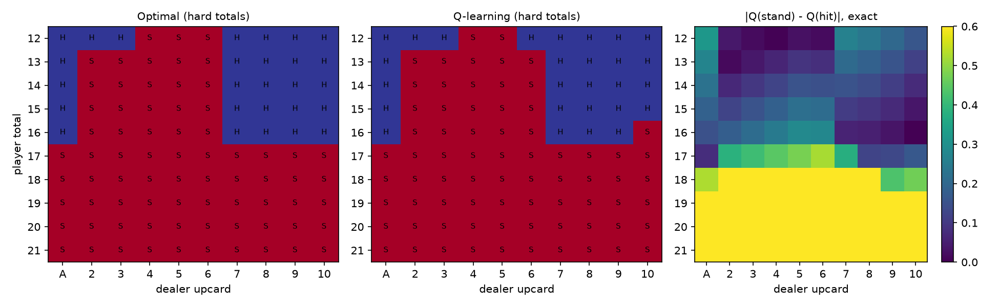

# Blackjack: an exact solution, and what it is good for

Blackjack dealt with replacement is a finite Markov decision process, so it can
be solved **exactly** rather than approximately. That exact solution is the
point of this project — not because the game matters, but because having a
known-correct answer makes it possible to say precisely how wrong everything
else is.

Four things are built on top of it:

1. **The exact optimum** by value iteration, matched against published figures.
2. **A model-free agent** (Q-learning) that knows none of the rules, checked
   against that optimum — and its residual error priced in basis points, not
   in "percentage of cells that agree".
3. **A finite six-deck shoe** with Hi-Lo counting, where the edge stops being
   constant and becomes something worth measuring.
4. **Kelly sizing and risk analytics** on the measured edge, with the
   statistical machinery to decide when an edge is real enough to bet on.

```
147 tests    2,168 lines of code    1,580 lines of tests
```

---

## Headline results

| | computed | published |
|---|---|---|
| Value iteration converges in | 13 sweeps | |
| Expected return, hit/stand only | **−2.421%** | −2.421% |
| Expected return, doubling allowed | **−1.087%** | −1.087% |
| Value of the option to double | +1.334% | |

Tabular Q-learning over 5 million hands, against that exact solution:

| | |
|---|---|
| mean squared error against V\* | 6.5 × 10⁻⁵ |
| decisions matching the optimal policy | 98.5% (197 of 200) |
| **cost of the remaining mismatches** | **2.47 basis points** |

The last row is the one that matters. Three cells out of two hundred still
disagree. Rather than report that as "98.5% accurate", the learned policy is
evaluated exactly — the same Bellman backup, without the max — and the
difference in expected value taken. The mismatches cost 2.47 bps against a
house edge of 242 bps: about 1% of the edge the game already takes. They sit
where standing and hitting are worth almost the same, so choosing wrongly
costs almost nothing.

---

## Checking the answer

The expected value is a number that could be wrong in ways that still look
reasonable, so it is checked three independent ways:

1. **Against published figures.** −2.421% and −1.087% for these rules, to five
   significant figures.
2. **Against simulation.** The solver computes transition probabilities by hand
   and never simulates; the environment simulates and never uses those
   probabilities. Playing the optimal policy for 300,000 hands lands within
   three standard errors of the exact value. An error would have to appear in
   both, the same way, independently.
3. **Against a model-free method.** Q-learning starts from nothing but sampled
   rewards and arrives at the same value function.

A fourth check appears in Phase 3: the edge measured over a finite shoe
aggregates to −1.074%, against −1.087% computed exactly here — 1.3 bps apart,
inside one standard error, from two calculations that share no code.

---

## What the mismatches cost depends on which ones they are

Three seeds, five million hands each:

| seed | matching | cost | cells that disagree |
|---|---|---|---|
| 42 | 98.5% | 2.47 bps | soft 18 v A, soft 18 v 2, hard 12 v 6 |
| 7 | 99.0% | **0.44 bps** | hard 16 v 10, hard 12 v 4 |
| 2024 | 98.5% | 1.90 bps | soft 18 v 5, hard 12 v 4, soft 18 v 4 |

The count of wrong cells barely moves; the cost moves by a factor of **5.6**.
Seed 7 happens to miss two of the cheapest cells on the chart — hard 16 against
a ten, where the exact gap between standing and hitting is 0.0006, and hard 12
against a four, where it is 0.0025 — so being wrong there is almost free.

That is the argument for reporting basis points: "three cells wrong" is
compatible with anything from 0.44 to 2.47 bps, so the cell count does not
answer the question anyone actually has.

It is **not** an argument that the basis-point figure is more stable. An
earlier version of this analysis, run before the step-size definition was
corrected, appeared to show exactly that. The pattern did not survive the
correction, and quoting it would have been reading a coincidence as a finding.
Both metrics are noisy at this sample size. One of them is in units that mean
something.

---

## Two things I got wrong first

**The dealer's peek.** When the dealer shows an ace or a ten they check for
blackjack before the player acts, so every decision is made conditional on the
dealer not having one. The hole-card distribution has to be renormalised by
that event. My first version did not, which shifted the expected value by 0.16
percentage points — from −1.087% to −1.249% — while still producing a
strategy chart that looked exactly like the published one. Being wrong by a
visible amount while looking fine is what makes it worth a comment in the code.

**The step size.** With the usual choice α = (1+N)^−0.6 the error plateaued and
only 96% of decisions matched. What made it diagnosable was that every mismatch
went the same way — the agent hit where the optimum stands. A one-sided error
is bias, not noise, so this was not a matter of training longer.

The step size α_n = n^−ω averages over an effective window of about n^ω
samples, so residual noise scales like σn^−ω/2 and the mean squared error like
n^−ω. Sweeping ω at a fixed budget of one million hands:

| ω | 0.6 | 0.7 | 0.8 | 0.9 | 1.0 |
|---|---|---|---|---|---|
| MSE at 1M hands | 2.0e−3 | 9.0e−4 | 4.2e−4 | **2.2e−4** | 2.3e−4 |

ω = 1 gives α = 1/n, the exact sample mean, and still satisfies Robbins–Monro
since Σ1/n diverges while Σ1/n² does not. Roughly a nine-fold improvement over
ω = 0.6.

Note the curve **flattens and slightly reverses** at the top: ω = 0.9 and
ω = 1.0 are indistinguishable. There is a reason. At ω = 1 every sample carries
equal weight forever, including the earliest ones — whose targets were
bootstrapped from a Q table that was still essentially empty. Slightly ω < 1
decays that early contamination away. Pure Monte Carlo averaging of terminal
rewards would show no such effect, so this is specifically a consequence of
bootstrapping.

**A caveat on testing that law.** It is tempting to check n^−ω by
extrapolating across the table above — raising ω from 0.6 to 1.0 at n = 10⁶
should divide the error by 10⁶·⁰·⁴, about 400. It does not; the measured
improvement is about 9. The law describes decay in n at a **fixed** ω and says
nothing about the prefactor, which also depends on ω. Tested properly —
following the error in n at fixed ω = 1 — the fitted slope of log MSE against
log n is **−1.09, against −1.00 predicted**. That is the confirmation; the
sweep is a budget comparison, not a test of the law.

---

## Phase 3: a finite shoe, and card counting

With cards drawn with replacement the edge is identical on every hand, so there
is nothing to bet on. A six-deck shoe dealt without replacement changes that: as
cards leave, what remains gets richer or poorer in the cards that favour the
player, and a Hi-Lo running count normalised by decks remaining ("true count")
summarises that in one number.

Playing the *fixed* Phase 1 strategy against the shoe for 3 million hands,
recording each outcome under the count that preceded the deal:

| true count | hands | edge | 95% interval |
|---|---|---|---|
| < −3 | 262,112 | −3.429% | [−3.861, −2.998] |
| −3..−2 | 202,822 | −2.211% | [−2.698, −1.724] |
| −2..−1 | 373,115 | −1.890% | [−2.248, −1.533] |
| −1..0 | 567,873 | −0.973% | [−1.262, −0.684] |
| 0..1 | 796,606 | −0.942% | [−1.186, −0.699] |
| 1..2 | 352,521 | −0.404% | [−0.769, −0.039] |
| 2..3 | 193,357 | **+0.267%** | [−0.222, +0.757] |
| ≥ 3 | 251,594 | **+0.890%** | [+0.463, +1.317] |

The edge is monotone across all eight bins and crosses zero near a true count of
+2. Aggregated it comes to **−1.074%**, against **−1.087%** computed exactly in
Phase 1 — 1.3 bps apart, well inside one standard error.



### The bug this was designed to avoid

A bet is placed before any card of the hand is visible, so the only count that
may be used for sizing is the one that preceded the deal. Reading the count
*after* the hand's cards are out, and attributing the outcome to it, uses
information that did not exist at decision time — look-ahead bias, the same
error as a backtest that reads tomorrow's prices.

It raises no exception. It produces a smooth, convincing, entirely fictitious
edge curve. The defence is structural rather than disciplinary: the environment
snapshots the count as the first statement of `reset()`, before dealing
anything, so a caller cannot obtain the wrong one. A second, subtler version —
sizing on the stale count of a shoe that has just reached penetration and is
about to be shuffled — is handled by `pre_deal_true_count()`.

Both are pinned by tests, and both are verified by mutation: reintroducing
either version turns tests red rather than passing quietly.

---

## Phase 3b: learned index plays

Adding the count bin to the state (200 → 1600 decision states) and training
8 million hands, the agent departs from the infinite-deck policy in 51 cells.
Sorted by how much data supports them:

| hand | true count | change | hands seen |
|---|---|---|---|
| hard 16 vs 10 | 0..1 | hit → **stand** | 68,681 |
| hard 15 vs 10 | 1..2 | hit → **stand** | 32,127 |
| hard 16 vs 10 | 1..2 | hit → **stand** | 30,770 |
| hard 13 vs 2 | 0..1 | stand → **hit** | 20,104 |
| hard 12 vs 6 | −1..0 | stand → **hit** | 10,948 |

The top row is the most famous index play in blackjack: stand on 16 against a
ten once the true count reaches zero. The agent found it from nothing but
sampled rewards, at the threshold the published tables give. Every deviation is
coherent in direction — 14/15/16 switch to standing when the shoe is ten-rich
and hitting is more likely to bust, 12/13 switch to hitting when it is low-rich.

**But the tails are undersampled and should not be trusted.** The true count is
bell-shaped around zero, so the extreme bins get a small fraction of the data.
The least-visited cell has 115 hands against a median of 3,189, while Phase 2
established the agent's noise floor at around 0.007 — larger than many of the
value gaps involved. The central-bin deviations are real; the tail ones are
noise wearing a policy's clothing.

---

## Phase 4: how much to bet

Kelly maximises the expected logarithm of wealth, because gains compound
multiplicatively. For a payoff `X` per unit staked the growth-optimal fraction
is `f* = mu / E[X^2]` — not `(bp−q)/b`, which is the two-outcome special case
and silently drops the 1.5 and ±2 payoffs blackjack actually has.

That formula is **second order in f**, not the exact maximiser of
E[log(1+fX)], which has no closed form here. Measured on the ≥3 count bin
(mu = 0.00890, E[X²] = 1.19474) the Taylor value is 0.00745 against a numerical
optimum of 0.00746 — it **under**-bets by 0.1%. The direction follows from the
sign of the third moment: E[X³] = +0.213 here, positively skewed by the +1.5
natural and the +2 double, so the next Taylor term raises the optimum. A
negatively skewed payoff would reverse that, which is why "the second-order
formula over-bets on skewed distributions" is only right half the time.

**The significance gate refuses 7 of 8 bins.** Only the ≥3 bin has a lower
confidence bound above zero. The 2..3 bin has a positive point estimate
(+0.267%) but an interval straddling zero, so it is not bet on. An edge measured
from a finite sample is partly noise, and Kelly applied to a noisy estimate does
not merely add variance — it systematically overbets.

**Where the loss comes from matters more than where the edge is.** The two
positive bins contribute +0.09% between them; the six negative bins take
−1.17%. So the decisive question is not how hard to bet the good counts but
whether you must play the bad ones:

| | median final | mean drawdown |
|---|---|---|
| flat 1 unit, must bet every hand | 959.0 | 11.5% |
| half Kelly, still must bet every hand | 962.4 | 14.4% |
| half Kelly, allowed to sit out | **1017.3** | 9.0% |
| full Kelly, allowed to sit out | **1027.8** | 17.3% |

These are the exact output of `python main.py risk --paths 400`.

Bet variation alone, with a compulsory minimum bet, does not overcome the house
edge under these rules. Being able to decline the bad counts does.

Full Kelly grows faster than half Kelly and has nearly double the drawdown —
the expected ordering, and if it were absent that would signal a bug.



### Separating betting from playing

Changing the sizing rule and the playing strategy together and observing an
improvement tells you nothing about which caused it. Running all four
combinations on identical seeds — so every configuration sees the same cards in
the same order — makes the two effects separable:

| mean final bankroll | flat bet | Kelly bet |
|---|---|---|
| fixed strategy | 956.4 (baseline) | 1017.9 |
| count strategy | 960.8 | 1021.0 |

Because the seeds are shared, the paths can be **paired**, which removes most of
the path-to-path variance and is far more powerful than comparing the two
distributions independently:

| effect | paired difference | standard error | t |
|---|---|---|---|
| bet sizing | **+61.45** | 4.80 | **+12.80** |
| count-dependent play | +4.41 | 2.53 | +1.74 |

Bet sizing is unambiguous. Count-dependent play is a small positive effect that
**this sample size cannot resolve** — t = 1.74 does not clear the conventional
threshold, and separating it from zero would need roughly four times as many
paths.

Two methodological notes, both mistakes made first and then corrected:

*Use the paired mean, not the medians.* Comparing medians of the four
distributions independently gave the playing effect as −2.0 — the wrong sign.
The median is a robust summary of one distribution but a noisy estimator of a
difference between two, and here it inverted the conclusion.

*Do not compute a percentage split from a non-significant term.* An earlier
version reported "97% from betting, 3% from playing" against the roughly 90/10
quoted by Griffin and Wong. That figure was not defensible: a share cannot be
taken of a quantity indistinguishable from zero, and the denominator was built
from an estimate whose own sign was uncertain. The honest statement is the
direction and the significance — betting dominates, by a margin this experiment
resolves clearly — with the split left unquoted.

### Where the theory does not apply, and why

The closed-form risk of ruin under fractional Kelly, `P(touch x) =
x^((2−λ)/λ)`, predicts 12.5% for half Kelly and 50% for full Kelly. Measured
ruin here is 0% in every configuration.

That is not a bug — the approximation simply does not hold. It assumes
continuous time, infinitely divisible bets, a known edge, and an infinite
horizon. Here the horizon is 5,000 hands, only about 8% of which are bet above
the minimum, and Kelly asks for well under 1% of bankroll even then. Total
exposure is far too small for the bankroll to approach half its starting value;
reaching the threshold would be roughly a three-sigma event. Reporting the gap
and its cause is more informative than quietly omitting the comparison.

CVaR is quoted with a bootstrap interval — VaR 144, CVaR 173 with a 95%
interval of [143, 188] — because a 99% tail statistic estimated from 400 paths
rests on about four observations, and a point estimate alone would overstate the
precision.

---

## Defects found by review, and what they changed

Every one of these was found *after* the test suite was green, and none of them
crashed anything. They are recorded rather than quietly fixed because the
pattern is the interesting part: the dangerous errors in quantitative code are
the ones that produce plausible numbers.

**The step size was not the sample mean it claimed to be.** The code used
α = (1 + N)^−ω with N counting visits from 1, so the first visit took α = ½ and
the estimate became half the observed reward. Unrolling the recursion gives
Q_n = [n/(n+1)] × (sample mean): permanently shrunk toward the initial zero.
The fix is α = N^−ω.

Worse, a unit test asserted the buggy value, so the suite was **protecting** the
bug rather than catching it. That test now asserts the correct value, alongside
two new ones checking that a single sample gives back that sample and that
repeated updates converge on the arithmetic mean.

**CVaR was understated whenever probability mass sat exactly at VaR.**
Averaging every loss at-or-above VaR is correct only for a continuous
distribution. With 99 break-even paths and one wipeout at 100, VaR at 90% is 0,
so that average sweeps in all 100 paths and returns 1.0 — where the worst 10%
(nine zeros and one 100) averages 10.0, ten times larger. Discrete payoffs make
this ordinary, not exotic. The fix uses the exact expected-shortfall identity.

**A read-only query mutated the agent.** `greedy_policy()` broke ties using the
agent's own generator, so evaluating the agent at training checkpoints perturbed
the training itself: the final Q table depended on how often it had been
inspected (measured maximum divergence 0.48). An observer effect in the middle
of a reproducibility guarantee is worse than the cosmetic bias it was fixing —
which had itself been measured at 0.000000 bps. The tie-break now uses a
locally seeded generator.

**A test asserted a coincidence as though it were an invariant.** The
convergence test required every disagreeing cell to have |Q(stand) − Q(hit)|
below 0.05. That held for one step-size schedule and one seed. It is not a
property of the game: soft 18 against a 2 has an exact gap of 0.0588, so any run
that misses that cell fails a threshold the game itself violates. The test now
bounds the aggregate cost in basis points, which is the claim that actually
matters.

**Four docstring figures did not match measurement.** The peek renormalisation
was described as shifting EV by "about 0.3%" (measured: 0.16 percentage
points); naturals as ending "roughly 8%" of hands (measured: 9.1%); the
per-hand standard deviation in a test constant as 1.14 (measured under optimal
hit/stand play: 0.984 — 1.14 is the figure for the game *with* doubling, which
that test does not play, so its bound was 16% looser than it looked); and the
shoe's state count as exceeding the number of seconds since the Big Bang (it is
6× smaller — the honest comparison is 590 petabytes of storage).

---

## Design notes

**The step size decays per state-action pair, not on a global clock.** Visit
frequencies are very uneven — measured 135× between the most and least visited
cell of the decision region. On a global clock the step size would collapse at
rare states that have barely been updated, breaking the Robbins–Monro condition
exactly where the estimates are worst.

**Exploration decays to a floor, not to zero.** This keeps every pair reachable.
It is safe only because Q-learning is off-policy: the max in the target means it
learns the value of the greedy policy whatever the behaviour policy does. SARSA
under the same schedule would converge to the value of the ε-greedy policy.

**The shoe is an explicit 312-card array, not a count vector.** Dealing a card
that was never in the shoe becomes structurally impossible rather than merely
detectable. Prefer designs where a bug cannot happen over designs where it can
be caught.

**Every random source is created from a seed and passed explicitly.** Nothing
touches the global numpy state, so a run is reproducible from its seed alone —
verified bit-identical across Windows and Linux.

---

## Figures



Value error and decision agreement against training length, with the n^−1
reference line the step size predicts.



The exact and learned charts, and beside them the exact gap between the value of
standing and of hitting. The cells that disagree sit in the dark region of the
third panel, where the gap is smallest.

---

## Running it

```bash
pip install -r requirements.txt

pytest -m "not slow"     # 146 tests, about 8 seconds
pytest                   # 147, adds the 1M-hand convergence check

python main.py dp --chart --double     # exact solution and strategy chart
python main.py ql --episodes 5000000   # Q-learning against that solution
python main.py omega                   # step-size exponent sweep
python main.py count --hands 3000000   # edge by true count
python main.py risk --paths 400        # Kelly sizing and risk metrics
python main.py figures                 # regenerate all five figures
```

---

## Layout

```
blackjack/
  rules.py            card distribution, hand arithmetic, seeded generators
  hand.py             blackjack rules shared by both environments
  env.py              infinite-deck simulator
  dp.py               dealer distribution, value iteration, policy evaluation
  qlearning.py        tabular agent, training loop, comparison against V*
  shoe.py             six-deck shoe, dealt without replacement
  counting.py         Hi-Lo, true count, look-ahead-safe payoff tracker
  finite_env.py       finite-shoe simulator, count exposed safely
  qlearning_count.py  agent over the count-augmented state
  simulate.py         playing hands, measuring edge, bankroll paths
  sizing.py           Kelly fraction, fractional Kelly, significance gate
  risk.py             VaR, CVaR, drawdown, risk of ruin, bootstrap
  plots.py            the five figures

tests/                147 tests
  test_rules.py             13    card distribution and hand arithmetic
  test_dp.py                16    exact solution, including a 300k-hand cross-check
  test_qlearning.py         15    update rule, convergence, side-effect freedom
  test_shoe.py              15    composition, conservation, reshuffling
  test_counting.py          31    Hi-Lo, true count, look-ahead safety
  test_kelly.py             27    Kelly formula, sizing gate, risk measures
  test_qlearning_count.py   18    count-augmented agent
  test_simulate.py          12    bet sizing on the pre-deal count, bankroll mechanics

docs/                 a written guide, in Vietnamese
main.py               command-line entry point
```

---

## Limitations

Splitting is not implemented, which is worth roughly +0.6% of expected value, so
−1.087% is not the full house edge for these rules.

`main.py` has no tests. It is the only layer without coverage, and it is exactly
where one defect slipped through: a stale function signature that made
`main.py risk` crash while all 117 tests stayed green.

Index-play results in the tail count bins rest on too little data to be trusted;
see Phase 3b.

The risk-of-ruin comparison against the closed form is not a meaningful test at
this horizon, for the reasons given above.

Wonging — declining to bet at unfavourable counts — is modelled as staking zero
while the hand is still dealt. A real player must also avoid being noticed doing
it, which is outside the scope of anything measurable here.